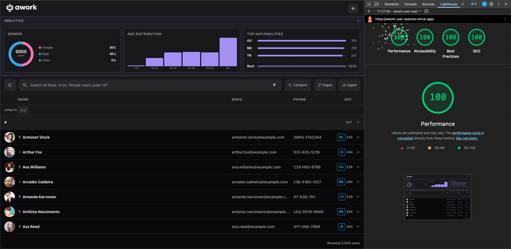
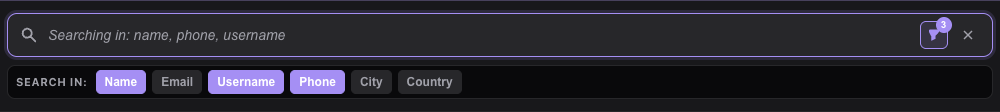
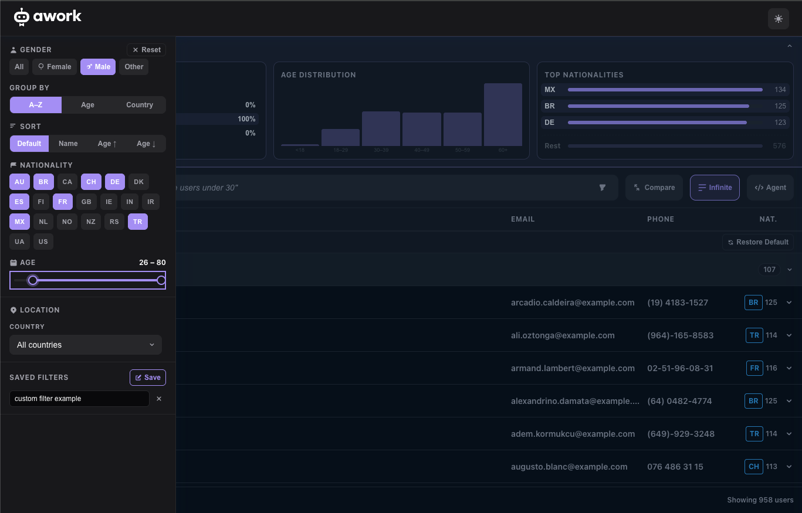
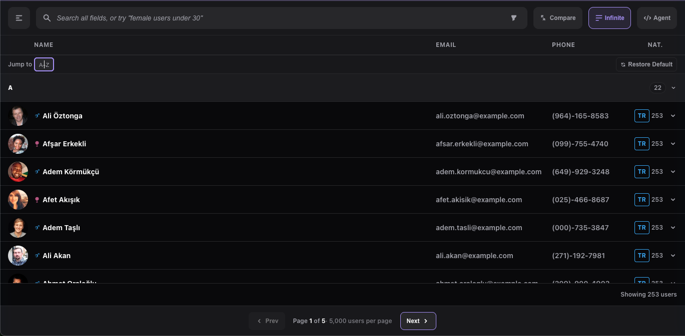
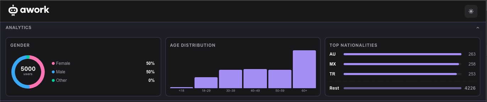
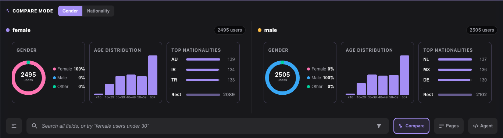
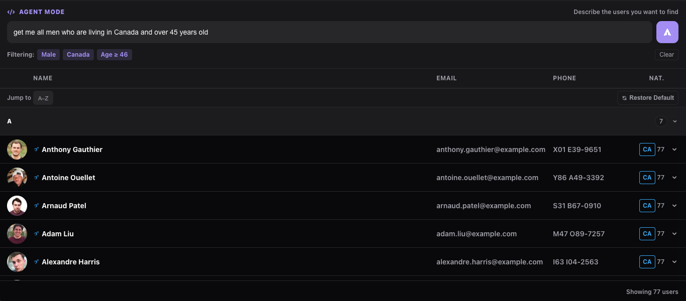

# awork Challenge — Angular User Directory

> A production-grade Angular 20 single-page application that fetches, groups, filters, and explores 5,000 users from the [Random User API](https://randomuser.me/documentation). Built as a coding challenge, it demonstrates senior-level decisions around performance, accessibility, testing, and developer experience.

🚀 **[Live Demo → awork-user-explorer.vercel.app](https://awork-user-explorer.vercel.app)**  
📄 **[Solution & Decision Log →](SOLUTION.md)** — how I approached the problem, architectural decisions, and trade-offs made

---

## Lighthouse Scores



---

## Table of Contents

- [Live Features](#live-features)
- [Quick Start](#quick-start)
- [Scripts Reference](#scripts-reference)
- [Architecture](#architecture)
- [Key Technical Decisions](#key-technical-decisions)
- [Performance Profile](#performance-profile)
- [Testing](#testing)
- [Accessibility](#accessibility)
- [CI/CD & Deployment](#cicd--deployment)
- [SEO Considerations](#seo-considerations)
- [AI-Assisted Development](#ai-assisted-development)
- [Possible Next Features](#possible-next-features)

---

## Live Features

### Search & Filtering



| Feature | Detail |
|---|---|
| **Smart search bar** | Debounced 250 ms keyword search across any combination of name, email, username, phone, city, or country — toggled via field chips |
| **Natural language parsing** | Type `"female users under 30 from Germany"` and it extracts gender, age ceiling, and nationality filters from the sentence |
| **Gender filter** | Toggle female / male / other — reflected on the analytics donut in real time |
| **Nationality filter** | 21 ISO country chips; multi-select; stacks with other filters |
| **Age range slider** | Dual-handle range (18–80); handles clamp to avoid crossing |
| **Location filter** | Cascading country → state → city dropdowns; populated from the live dataset |
| **Saved filters** | Name and persist any combination of filters to `localStorage`; restore or delete at any time |



### Grouping, Sorting & Pagination



| Feature | Detail |
|---|---|
| **Group by** | Switch between A–Z letter / age bracket / nationality groupings live |
| **Sort** | Default order, name A–Z, age ascending, age descending |
| **Jump-to-letter** | Single-character input scrolls the virtual list directly to the matching group |
| **Collapsible groups** | Click/Enter/Space on any group header to collapse or expand it |
| **Pagination / infinite scroll** | Toggle between page-based (5,000 users per page) and continuous infinite-scroll modes |

### Analytics Panel



| Feature | Detail |
|---|---|
| **Gender donut chart** | SVG arc chart; click legend buttons to filter by segment |
| **Age histogram** | Bar chart of age buckets; click a bar to apply that age bracket as a filter |
| **Top nationalities** | Ranked bar list; click any country to toggle it in the nationality filter |
| **Collapsible** | The entire analytics section can be expanded or collapsed to reclaim vertical space |

### Compare Mode



| Feature | Detail |
|---|---|
| **Compare mode** | Side-by-side analytics comparing two gender or nationality segments |

### AI Agent Mode



| Feature | Detail |
|---|---|
| **Agent mode** | Natural-language → filter via Groq LLM API (llama-3.1-8b-instant); gracefully disabled without a key |

> **Groq API key required.** Get a free key (no credit card) at [console.groq.com/keys](https://console.groq.com/keys) and add it to `src/environments/environment.ts`.

### User Experience

| Feature | Detail |
|---|---|
| **User detail panel** | Click any row to slide open a rich detail view with avatar, contact info, address, and nationality peer count |
| **Dark / light mode** | Reads `prefers-color-scheme` on load; toggle persisted to `localStorage` |
| **Skeleton loaders** | Shimmer placeholders during initial fetch — no layout shift |
| **Error banner** | HTTP failures surface a descriptive banner; app stays interactive |
| **Restore Default** | One-click reset of all filters, grouping, sort, and compare state |
| **404 page** | Unknown routes show a clean not-found page with a home link |

---

## Quick Start

```bash
git clone https://github.com/jadzeino/awork-user-explorer.git
cd awork-user-explorer
npm install
npm start          # http://localhost:4200
```

### Agent Mode (optional)

Agent Mode uses the [Groq API](https://console.groq.com) (free tier, no credit card required) to translate natural-language queries into structured filters.

1. Get a free key at [console.groq.com/keys](https://console.groq.com/keys)
2. Open `src/environments/environment.ts` and replace `'your-groq-api-key-here'` with your key

Without a key the app is fully functional — Agent Mode shows a configuration notice.

---

## Scripts Reference

| Script | Description |
|---|---|
| `npm start` | Dev server with HMR at `http://localhost:4200` |
| `npm run build:prod` | Production build with optimisations + budget checks |
| `npm test` | Jest unit tests in watch mode |
| `npm run test:ci` | Jest single run (CI-friendly, no watch) |
| `npm run test:e2e` | Playwright E2E suite (starts dev server automatically) |
| `npm run lint` | ESLint — zero warnings allowed (`--max-warnings=0`) |
| `npm run format` | Prettier auto-format |
| `npm run format:check` | Prettier check (CI-friendly) |

---

## Architecture

```
src/
├── app/
│   ├── core/
│   │   ├── models/          # Strict TypeScript interfaces (User, GroupBy, SortBy…)
│   │   ├── services/
│   │   │   ├── filter.service.ts        # Centralised signal-based filter state + NL parser
│   │   │   ├── users.service.ts         # HTTP fetch, Zod validation, shareReplay cache
│   │   │   ├── grouping.service.ts      # Web Worker bridge with per-request Subject map
│   │   │   ├── saved-filters.service.ts # localStorage persistence for named filter presets
│   │   │   └── theme.service.ts         # prefers-color-scheme + localStorage toggle
│   │   └── validation/
│   │       └── user.schema.ts           # Zod schemas for API response boundary
│   ├── features/
│   │   └── users/
│   │       ├── components/
│   │       │   ├── analytics/           # Gender donut, age histogram, top-nats chart
│   │       │   ├── agent-mode/          # Groq LLM natural-language → filter
│   │       │   ├── command-bar/         # Search bar with field chips + NL parser
│   │       │   ├── compare-mode/        # Side-by-side analytics comparison
│   │       │   ├── faceted-filters/     # Gender / nat / age range / group / sort panels
│   │       │   ├── location-filter/     # Cascading country → state → city selects
│   │       │   ├── saved-filters/       # Save, apply, and delete named filter presets
│   │       │   ├── user-detail/         # Slide-in detail panel (dialog role, focus trap)
│   │       │   ├── user-filters/        # Filter drawer container (slide-over panel)
│   │       │   ├── user-item/           # Single virtual-scroll row
│   │       │   └── user-list/           # CDK virtual scroll viewport + group headers
│   │       └── containers/
│   │           └── users-page/          # Orchestration: wires services → components
│   └── shared/
│       └── components/
│           ├── skeleton/                # Reusable shimmer placeholder row
│           └── not-found/              # 404 page with home link
├── workers/
│   ├── grouping.logic.ts    # Pure filter + group + sort functions (fully testable)
│   └── grouping.worker.ts   # Web Worker wrapper, echoes __id for request matching
└── environments/
    └── environment.ts        # gitignored — add your Groq API key here
e2e/
├── fixtures/
│   └── users.json           # 8-user deterministic fixture for Playwright tests
└── app.spec.ts              # 16 E2E scenarios
```

---

## Key Technical Decisions

### Virtual Scrolling (Angular CDK)
5,000 users are flattened into a single `VirtualRow[]` union array containing group headers and user rows. `cdk-virtual-scroll-viewport` with `itemSize="56"` keeps the live DOM to roughly 20 nodes regardless of dataset size.

### Web Worker for Grouping & Filtering
All filtering, sorting, and grouping runs in `grouping.worker.ts` off the main thread. Each request carries a monotonic `__id`; the worker echoes it back so `GroupingService` resolves only the matching `Subject` via a `Map<id, Subject>`. Concurrent requests are safe — no stale results can surface. `switchMap` in the container disposes superseded in-flight requests. A synchronous `runGrouping()` fallback activates when `Worker` construction fails (test environments, SSR).

### Zod Validation at the API Boundary
`ApiResponseSchema` validates every HTTP response field. On a schema mismatch it logs the issue and falls back to a lenient filter that rejects only records missing `uuid`, `name.first`, or `email`. Partial API degradation never crashes the app.

### Signal-First State Management
`FilterService` holds a single `signal<FilterState>` as the source of truth. Components receive the signal directly and read from it inside `computed()` or templates — no intermediate BehaviorSubjects, no manual subscriptions. `FilterService.update()` merges partial patches, keeping update sites minimal.

### RxJS Caching (`shareReplay(1)`)
`UsersService` constructs `users$` once. Every subsequent `getUsers()` call receives the cached replay with zero additional HTTP requests. `combineLatest([users$, filterState$])` in the container re-triggers the worker on every state change without re-fetching.

### OnPush Change Detection Everywhere
All 13 components use `ChangeDetectionStrategy.OnPush`. The original O(n²) nationality-count bottleneck was replaced by a single `computed()` `Map<nat, count>` built once per render cycle.

### Natural Language Parser
`parseNaturalLanguage()` in `filter.service.ts` uses a token-consumption approach: it matches gender, age patterns (`under 30`, `between 25 and 40`, `at least 50`), nationality keywords (`german`, `from france`), sort directives, and group-by directives — consuming each matched token before passing the remainder as a keyword search. This keeps the parser composable and prevents partial overlaps (e.g., `iran` inside `iranian`).

### Input Sanitisation
Search queries strip `< > " ' &` before the substring match in the worker. Age inputs use `type="number"` with `min`/`max` HTML attributes plus a guard against `NaN`. `maxlength="100"` on the search field prevents excessively long strings reaching the worker.

### Dark / Light Mode
`ThemeService` reads `prefers-color-scheme` on first load, persists the choice to `localStorage`, and sets `data-theme` on `<html>`. All colours are semantic CSS custom properties in two token sets. No JavaScript is needed for repaints — a single attribute change on `<html>` triggers the cascade.

---

## Performance Profile

| Concern | Naïve approach | This implementation |
|---|---|---|
| DOM nodes for 5k users | 5,000+ nodes | ~20 (virtual scroll) |
| Nationality count per render | O(n²) | O(n) once, `computed()` cached |
| Change detection | Default (full tree) | OnPush everywhere |
| Grouping / filtering thread | Main thread (blocks UI) | Web Worker |
| API deduplication | New request per subscriber | `shareReplay(1)` |
| Loading UX | Empty screen / spinner | Skeleton shimmer rows |
| Animations for motion-sensitive users | Always plays | `prefers-reduced-motion` respected |

---

## Testing

### Unit Tests — Jest

```bash
npm run test:ci     # single run
npm test            # watch mode
```

**5 test suites · ~65 assertions · zero Jasmine dependencies**

| Suite | What it covers |
|---|---|
| `grouping.logic.spec.ts` | All groupBy modes, every filter type, sort orders, combined filters, edge cases, XSS input safety |
| `filter.service.spec.ts` | `parseNaturalLanguage` — gender, age patterns, nationality detection, sort/group directives, combined queries |
| `user.schema.spec.ts` | Valid API mapping, Zod graceful fallback on malformed data, UUID image URL generation |
| `users.service.spec.ts` | HTTP mapping, `shareReplay` deduplication, page caching |
| `app.component.spec.ts` | App bootstraps and header renders |

**Tooling choices:**
- `jest-preset-angular` v16 — Angular 20 compatibility
- `moduleNameMapper` stubs `GroupingService` to avoid `import.meta.url` incompatibility in Jest's CommonJS output
- `jsdom` test environment; `setupZoneTestEnv()` for Zone.js integration

### E2E Tests — Playwright

```bash
npm run test:e2e
```

Playwright auto-starts `ng serve` before the suite and tears it down after. The randomuser.me API is intercepted with a deterministic 8-user fixture so tests are fast (~4 s total) and never hit the network.

**16 scenarios covering:**

| Scenario | Area |
|---|---|
| App loads and renders | Happy path |
| Search filters the list | Command bar |
| Dark / light mode toggle | Theme |
| Pagination mode switch | List UX |
| Analytics panel collapse | Analytics |
| Filter drawer + backdrop | Filters |
| Gender filter (async worker) | Filters + Worker |
| User detail panel | Detail panel |
| Compare mode | Analytics |
| Agent mode toggle | Agent mode |
| Group-by Age | Grouping |
| Sort by Name | Sorting |
| Jump-to-letter | Navigation |
| Restore Default lifecycle | State reset |
| Nationality filter stacking | Filters |
| Save / apply / delete filter preset | Saved filters |

---

## Accessibility

This application targets **WCAG 2.1 Level AA**.

| Area | Implementation |
|---|---|
| Keyboard navigation | All interactive elements reachable and operable via Tab / Enter / Space / Escape |
| Screen reader regions | `role="dialog"` + `aria-labelledby` on detail panel; `aria-live="polite"` announces filter result count changes |
| Group headers | `aria-expanded` state exposed; label includes expand/collapse hint |
| Filter buttons | `aria-pressed` on all toggle buttons (gender, nationality, age bar, compare) |
| SVG charts | Outer `<svg>` elements carry `aria-hidden="true"`; all user-facing controls are real `<button>` elements in the legend |
| Focus management | Filter drawer moves focus to the first focusable element on open; Escape closes and returns focus to the trigger |
| Motion sensitivity | All `@keyframes` and `animation` declarations are wrapped in `@media (prefers-reduced-motion: no-preference)` |
| Colour contrast | All text meets 4.5:1 AA ratio in both light and dark themes; verified programmatically |
| Form inputs | All inputs have visible labels or `aria-label`; placeholders are supplementary |

---

## CI/CD & Deployment

### GitHub Actions — CI

Every push to `main` and every pull request runs the full quality gate automatically:

```
lint → test:ci → build:prod
```

The workflow is defined in [`.github/workflows/ci.yml`](.github/workflows/ci.yml).

### Vercel — Deployment

The app is deployed to [Vercel](https://vercel.com) with automatic deployments on every push to `main`. Pull requests receive isolated preview URLs.

Configuration is in [`vercel.json`](vercel.json):
- **Build command:** `npm run build:prod`
- **Output directory:** `dist/awork-challenge/browser`
- **SPA routing:** all paths rewrite to `index.html` so Angular Router handles navigation

🚀 **Production:** [awork-user-explorer.vercel.app](https://awork-user-explorer.vercel.app)

---

## SEO Considerations

> **Current state:** This submission is a pure client-side SPA. Crawlers receive the Angular HTML shell — dynamic content is invisible to them without JavaScript execution.

The project includes `public/robots.txt` and `public/sitemap.xml` pointing to the live Vercel URL as a baseline.

### Why SSR is not applicable here

Angular SSR is often the default recommendation for SEO, but it would provide no real benefit for this application — and adding it would be the wrong engineering call for two reasons:

1. **The data source returns randomised content.** The Random User API generates different users on every request. There are no stable, permanent URLs representing real people. A search engine indexing `/` today would find completely different content tomorrow — SSR cannot make that crawlable in any meaningful way.

2. **This is an internal exploration tool, not a public-facing page.** A user directory built for a team to browse and filter is not something you want indexed by Google. The value is in the interactive experience, which requires JavaScript regardless of rendering strategy.

The `robots.txt`, `sitemap.xml`, Open Graph tags, and `<meta name="description">` are committed as good hygiene and as a signal that SEO was considered. The architecture is ready for SSR to be layered on if the data source ever changes to stable, crawlable content.

### If the data source were stable — what SSR would add

**1. Server-Side Rendering (Angular SSR)**
```bash
ng add @angular/ssr
```
- Delivers pre-rendered HTML to crawlers and users on slow connections
- Angular 20 ships a fully supported SSR builder — migration is additive

**2. Meta tags per route**
Use `Meta` and `Title` services from `@angular/platform-browser` to set `<title>`, `<meta name="description">`, and Open Graph tags dynamically on each navigation event.

**3. Dynamic sitemap generation**
Generate the sitemap server-side (or at build time via SSG) to reflect real, stable URLs.

**4. Structured data (JSON-LD)**
Add `application/ld+json` blocks for the `Person` schema to enable rich search results for individual user profiles.

**5. Core Web Vitals impact**
- **LCP** — SSR delivers content in the first byte; no skeleton wait
- **CLS** — eliminates layout shift from deferred JS hydration
- **INP** — virtual scroll and Web Worker already keep the main thread responsive; no change needed

---

## AI-Assisted Development

This project was developed with the assistance of **Claude (Anthropic)** via the Claude Code CLI. The AI pair-programming workflow was used deliberately and transparently throughout.

### What was AI-assisted

| Area | How Claude was used |
|---|---|
| **Architecture decisions** | Discussed trade-offs (virtual scroll strategies, Web Worker concurrency model, signal vs BehaviorSubject) — final calls made by the developer |
| **Boilerplate generation** | Scaffold of component shells, interface definitions, and service skeletons |
| **Test authoring** | Jest unit test suites and Playwright E2E scenarios written collaboratively |
| **Debugging** | Traced `import.meta.url` / Jest CommonJS incompatibility; diagnosed async Web Worker timing in E2E tests |
| **Accessibility audit** | WCAG 2.1 AA review of all templates; identified and fixed orphaned ARIA attributes, missing `prefers-reduced-motion`, and dialog labelling |
| **Code quality** | ESLint rule violations, unused imports, weak equality operators, memory-leak patterns (unsubscribed HTTP streams) |
| **Documentation** | This README and CONTRIBUTING.md |

### Principles applied

- Every generated snippet was reviewed, understood, and often modified before commit
- Claude surfaced options and trade-offs; the developer made the final architectural decisions
- No code was blindly accepted — the AI acted as a senior pair-programmer, not an autopilot

### Why disclose this?

Transparent AI use is a professional signal, not a liability. Modern software teams already use Copilot, ChatGPT, and similar tools daily. Documenting *how* AI was used — and *what judgment calls the human made* — demonstrates self-awareness, intentionality, and the ability to leverage AI responsibly.

---

## Possible Next Features

These are well-scoped improvements that would make strong follow-on PRs:

### Performance & Scale
- **IndexedDB persistence** — store the 5k users locally so repeat visits load instantly with a stale-while-revalidate pattern
- **Service Worker / PWA** — offline support; installable on mobile
- **Background pagination** — fetch additional pages silently and merge into the cache

### Search & Discovery
- **Fuzzy search** — integrate a library like Fuse.js for typo-tolerant matching
- **Search history** — persist the last N queries in `localStorage` and show as suggestions
- **Advanced filter builder** — drag-and-drop rule composer (AND/OR logic across fields)
- **URL-serialised filters** — encode the full filter state in query params so filter views are shareable and bookmarkable

### Analytics & Visualisation
- **Timeline view** — plot users' date-of-birth on a time axis
- **Map view** — render user pins on a world map (Leaflet or MapLibre) grouped by nationality
- **Export** — download filtered results as CSV or JSON

### Collaboration
- **Shareable compare links** — serialise compare-mode state to URL
- **Annotation layer** — add notes to a user that persist locally
- **Bulk actions** — select multiple users to export or compare

### Infrastructure
- **Angular SSR** — enable server-side rendering for SEO and first-paint performance (see [SEO Considerations](#seo-considerations))
- **i18n** — Angular's built-in `$localize` for multi-language support
- **Docker** — `Dockerfile` + `nginx.conf` for containerised deployment

---

## Stack

| Layer | Technology |
|---|---|
| Framework | Angular 20 (standalone components, signals) |
| Language | TypeScript 5.9 (strict mode) |
| Styling | SCSS + CSS custom properties (BEM) |
| State | Angular Signals (no NgRx, no external store) |
| Async | RxJS 7.8 (`combineLatest`, `shareReplay`, `switchMap`) |
| Validation | Zod 3.24 |
| Virtual scroll | Angular CDK |
| Unit tests | Jest 30 + jest-preset-angular |
| E2E tests | Playwright 1.59 |
| Linting | ESLint 9 + @angular-eslint |
| Formatting | Prettier 3.5 |
| LLM integration | Groq API (llama-3.1-8b-instant) |
| CI | GitHub Actions |
| Hosting | Vercel |
